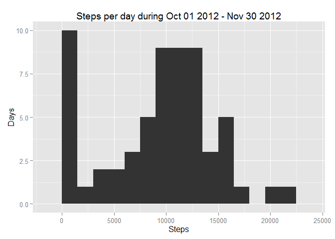
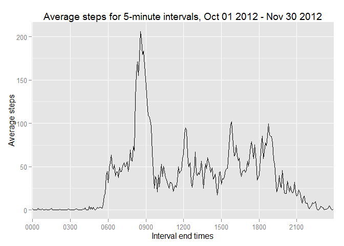
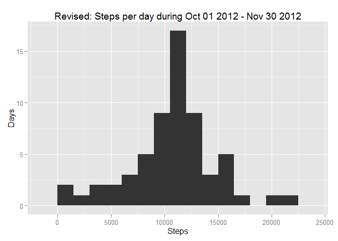
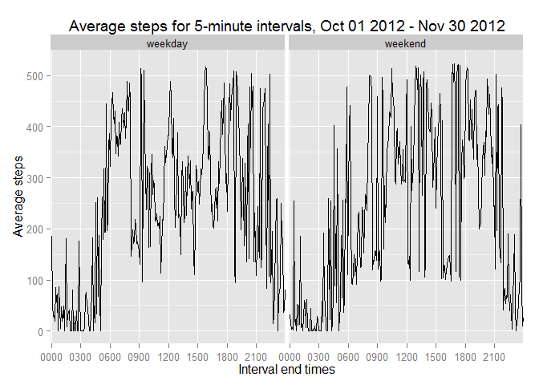

##Assignment 1, Reproducible research

This assignment makes use of data from a personal activity monitoring device.  
This device collects data at 5 minute intervals through out the day. The data  
consists of two months of data from an anonymous individual collected during the  
months of October and November 2012, and include the number of steps taken in  
5 minute intervals each day.

####Dataset:
Activity monitoring data [52K]  
**The variables included in this dataset are:**  
1. steps: Number of steps taking in a 5-minute interval  
2. date: The date on which the measurement was taken in YYYY-MM-DD format  
3. interval: Identifier for the 5-minute interval in which measurement was taken  

The dataset is stored in a comma-separated-value (CSV) file and there are a total  
of 17,568 observations in this dataset.

###Loading and preprocessing the data

**This section should hold code that is needed to:**  
1. Load the data  
2. Process the data into a suitable format

####Loading the data
Note, that setting up a working directory and a directory for where the data is  
stored is user specific and you might need to change this code lines to your own  
specifications.
Loading the data into an r object is a straight forward operation, with the data  
loaded into a data frame named *activity*, as shown below:


```r
    setwd("~/Data Science/4. Reproducible/Code/Week 2")
    fileURL <- "http://d396qusza40orc.cloudfront.net/repdata%2Fdata%2Factivity.zip"
    download.file(fileURL, destfile="ActivityData.zip", quiet=TRUE)
    unzip("ActivityData.zip")
    activity <- read.csv("activity.csv")
```

####Process the data into a suitable format
To get a feel for what we need to do, we analyze the structure and the summary  
of the data, while also taking a look at the first 15 observations:


```r
    str(activity)
```

```
## 'data.frame':	17568 obs. of  3 variables:
##  $ steps   : int  NA NA NA NA NA NA NA NA NA NA ...
##  $ date    : Factor w/ 61 levels "2012-10-01","2012-10-02",..: 1 1 1 1 1 1 1 1 1 1 ...
##  $ interval: int  0 5 10 15 20 25 30 35 40 45 ...
```

```r
    summary(activity)
```

```
##      steps               date          interval   
##  Min.   :  0.0   2012-10-01:  288   Min.   :   0  
##  1st Qu.:  0.0   2012-10-02:  288   1st Qu.: 589  
##  Median :  0.0   2012-10-03:  288   Median :1178  
##  Mean   : 37.4   2012-10-04:  288   Mean   :1178  
##  3rd Qu.: 12.0   2012-10-05:  288   3rd Qu.:1766  
##  Max.   :806.0   2012-10-06:  288   Max.   :2355  
##  NA's   :2304    (Other)   :15840
```

```r
    head(activity, n=15)
```

```
##    steps       date interval
## 1     NA 2012-10-01        0
## 2     NA 2012-10-01        5
## 3     NA 2012-10-01       10
## 4     NA 2012-10-01       15
## 5     NA 2012-10-01       20
## 6     NA 2012-10-01       25
## 7     NA 2012-10-01       30
## 8     NA 2012-10-01       35
## 9     NA 2012-10-01       40
## 10    NA 2012-10-01       45
## 11    NA 2012-10-01       50
## 12    NA 2012-10-01       55
## 13    NA 2012-10-01      100
## 14    NA 2012-10-01      105
## 15    NA 2012-10-01      110
```

**We can see that:**  
1. The *steps* variable includes quite a few NA values  
2. The *date* variable is a factor and not a date  
3. The *interval* increases with a factor 100 for every hour

For now, we leave things unchanged, and conclude the data is formated ok for the  
next step in the assignment list.  
One reason for why we leave the data unchanged is that the next part of the  
assignment explicitly states we can ignore the missing values in the dataset.

###Mean total number of steps taken per day
**For this part of the assignment, we should:**  
1. Calculate and make a histogram of the total number of steps taken each day  
2. Calculate and the mean and median of the total number of steps taken per day
  
####Total number of all steps each day


```r
    daysteps <- with(activity, tapply(steps, date, sum, na.rm=TRUE))
    daysteps <- data.frame(daysteps)
    days <- as.Date(row.names(daysteps), format = "%Y-%m-%d")
    dailysteps <- cbind(days, daysteps)
```

####Histogram of daily steps


```r
    library(ggplot2)
    graph <- ggplot(dailysteps, aes(x=daysteps)) 
    graph <- graph + geom_histogram(binwidth=1500)
    graph <- graph + labs(title="Steps per day during Oct 01 2012 - Nov 30 2012")
    graph <- graph + labs(x="Steps", y="Days")
    graph
```

 

The mean and median of total number of steps taken per day:


```r
    with(dailysteps, mean(daysteps, na.rm=TRUE))
```

```
## [1] 9354
```

```r
    with(dailysteps, median(daysteps, na.rm=TRUE))
```

```
## [1] 10395
```

###Examine the average daily activity pattern
**For this part of the assignment, we should:**  
1. Make a time series plot of the 5-minute interval and the average number of  
steps taken, averaged across all days  
2. Examine which 5-minute interval, on average across all the days in the dataset,  
contains the maximum number of steps

####Make a time series plot
To calculate the average number of steps taken for each 5-minute interval:


```r
    intsteps <- with(activity, tapply(steps, interval, mean, na.rm=TRUE))
    intsteps <- data.frame(intsteps)
    intervals <- row.names(intsteps)
    for(i in 1:length(intervals))   {
        while(nchar(intervals[i]) < 4)  {
            intervals[i] <- paste("0", intervals[i], sep="")
        }
    }
    intervalsteps <- cbind(intervals, intsteps)
```

Creating the timeseries plot:


```r
    library(ggplot2)
    graph <- ggplot(intervalsteps, aes(x=intervals, y=intsteps, group=1))
    graph <- graph + geom_line()
    graph <- graph + labs(title="Average steps for 5-minute intervals, Oct 01 2012 - Nov 30 2012")
    graph <- graph + labs(x="Interval end times", y="Average steps")
    #graph <- graph + theme(axis.text.x=element_text(angle=90))
    xlabels <- as.character(intervalsteps$intervals[row=seq(1,288, by=36)])
    graph <- graph + scale_x_discrete(breaks=xlabels)
    graph
```

 

####Interval with most steps


```r
    maxsteps <- max(intervalsteps$intsteps)
    as.character(with(intervalsteps, intervals[intsteps == maxsteps]))
```

```
## [1] "0835"
```

```r
    print(maxsteps)
```

```
## [1] 206.2
```

###Imputing missing values
**For this part of the assignment, we should:**  
1. Report the total number of missing values in the dataset (NAs)  
2. Fill in missing values according to personal strategy  
3. Create a new dataset with the missing data filled in  
4. Make a histogram of the total number of steps taken each day and  
- report the mean and median total number of steps taken per day  
- evaluate how they differ from the estimates from the first part of the assignment

####Report missing values
We already know from the summary above there is 2304 missing values, but to repeat:


```r
    summary(activity)
```

```
##      steps               date          interval   
##  Min.   :  0.0   2012-10-01:  288   Min.   :   0  
##  1st Qu.:  0.0   2012-10-02:  288   1st Qu.: 589  
##  Median :  0.0   2012-10-03:  288   Median :1178  
##  Mean   : 37.4   2012-10-04:  288   Mean   :1178  
##  3rd Qu.: 12.0   2012-10-05:  288   3rd Qu.:1766  
##  Max.   :806.0   2012-10-06:  288   Max.   :2355  
##  NA's   :2304    (Other)   :15840
```

####Fill in missing values and create new dataset
The strategy for filling in the missing values will be that we use the average  
number of steps for all days for any specific time interval.  
So, every NA value in the original *steps* variable in the data frame *activity*  
will be substituted with its corresponding average value for all days. The values  
will be stored in the new data frame *newactivity*, which is merged with  
*intervalsteps*, previously created.


```r
    newactivity <- cbind(subset(activity, select=c(steps, date)), intervals)
    newactivity <- merge(x=newactivity, y=intervalsteps, by.x="intervals", by.y="intervals")
    newactivity <- newactivity[order(newactivity$date, newactivity$intervals),]
    for (i in 1:length(newactivity$steps))  {
        if (is.na(newactivity$steps[i])) {
            newactivity$steps[i] <- newactivity$intsteps[i]
        }
    }
    newactivity <- subset(newactivity, select=c(steps, date, intervals))
```

Make a new check to verify everything is a-ok:


```r
    str(newactivity)
```

```
## 'data.frame':	17568 obs. of  3 variables:
##  $ steps    : num  1.717 0.3396 0.1321 0.1509 0.0755 ...
##  $ date     : Factor w/ 61 levels "2012-10-01","2012-10-02",..: 1 1 1 1 1 1 1 1 1 1 ...
##  $ intervals: Factor w/ 288 levels "0000","0005",..: 1 2 3 4 5 6 7 8 9 10 ...
```

```r
    summary(newactivity)
```

```
##      steps               date         intervals    
##  Min.   :  0.0   2012-10-01:  288   0000   :   61  
##  1st Qu.:  0.0   2012-10-02:  288   0005   :   61  
##  Median :  0.0   2012-10-03:  288   0010   :   61  
##  Mean   : 37.4   2012-10-04:  288   0015   :   61  
##  3rd Qu.: 27.0   2012-10-05:  288   0020   :   61  
##  Max.   :806.0   2012-10-06:  288   0025   :   61  
##                  (Other)   :15840   (Other):17202
```

```r
    head(newactivity, n=15)
```

```
##       steps       date intervals
## 1   1.71698 2012-10-01      0000
## 63  0.33962 2012-10-01      0005
## 128 0.13208 2012-10-01      0010
## 205 0.15094 2012-10-01      0015
## 264 0.07547 2012-10-01      0020
## 327 2.09434 2012-10-01      0025
## 376 0.52830 2012-10-01      0030
## 481 0.86792 2012-10-01      0035
## 495 0.00000 2012-10-01      0040
## 552 1.47170 2012-10-01      0045
## 620 0.30189 2012-10-01      0050
## 716 0.13208 2012-10-01      0055
## 770 0.32075 2012-10-01      0100
## 840 0.67925 2012-10-01      0105
## 880 0.15094 2012-10-01      0110
```

No NAs or other misshaps to be found here

####New histogram ot total steps each day
For starters we need to recalculate the total number of all steps each day:


```r
    newsteps <- with(newactivity, tapply(steps, date, sum, na.rm=TRUE))
    newsteps <- data.frame(newsteps)
    newdays <- as.Date(row.names(newsteps), format = "%Y-%m-%d")
    newdailysteps <- cbind(newdays, newsteps)
```

Then we can recreate the histogram:


```r
    library(ggplot2)
    graph <- ggplot(newdailysteps, aes(x=newsteps)) 
    graph <- graph + geom_histogram(binwidth=1500)
    graph <- graph + labs(title="Revised: Steps per day during Oct 01 2012 - Nov 30 2012")
    graph <- graph + labs(x="Steps", y="Days")
    graph
```

 

... and repeat the mean and median calculations:


```r
    with(newdailysteps, mean(newsteps, na.rm=TRUE))
```

```
## [1] 10766
```

```r
    with(newdailysteps, median(newsteps, na.rm=TRUE))
```

```
## [1] 10766
```

Both the mean and the median increased, to the extent that they both come out to  
the exact same value, which is a very interesting coincidence.  
This is a good indication the length of the daily walks follow a Gaussian distribution.  
Something that could not be detected as clearly from the orignial data.  
So the fact that this can be detected is an important impact of imputing missing  
data on the estimates of the total daily number of steps.

###Differences in weekend activity patterns
**For this section we should:**  
1. Create a new factor variable in the dataset with two levels, "weekday" and "weekend"  
2. Make a 2-panel plot containing a time series plot of the 5-minute interval and  
the average number of steps taken, averaged across all weekday days or weekend days

####Create a new factor variable

```r
    newactivity$daytype <- weekdays(as.Date(newactivity$date)) %in% c("Sunday","Saturday")
    newactivity$daytype <- factor(newactivity$daytype, levels=c(TRUE, FALSE), labels=c("weekend", "weekday"))
```

####Make a 2-panel plot
But first create a new data frame holding the average steps per time interval,  
subdivided into weekdays and weekends, and constructed so it fits with ggplot  
functionality:


```r
    splitactivity <- split(newactivity, newactivity$daytype)

    weekendsteps <- with(splitactivity$weekend, tapply(steps, intervals, mean, na.rm=TRUE))
    weekendsteps <- cbind(intervals, weekendsteps, "weekend")

    weekdaysteps <- with(splitactivity$weekday, tapply(steps, intervals, mean, na.rm=TRUE))
    weekdaysteps <- cbind(intervals, weekdaysteps, "weekday")

    dividedsteps <- rbind(weekdaysteps, weekendsteps)
    dividedsteps <- data.frame(dividedsteps, row.names=NULL)
    names(dividedsteps) <- c("intervals", "steps", "daytype")
    dividedsteps$steps <- as.numeric(dividedsteps$steps)
```

Create the 2-panel plot:


```r
    library(ggplot2)
    graph <- ggplot(dividedsteps, aes(x=intervals, y=steps, group=daytype)) 
    graph <- graph + geom_line() + facet_grid(.~ daytype)
    graph <- graph + labs(title="Average steps for 5-minute intervals, Oct 01 2012 - Nov 30 2012")
    graph <- graph + labs(x="Interval end times", y="Average steps")
    xlabels <- as.character(dividedsteps$intervals[row=seq(1,288, by=36)])
    graph <- graph + scale_x_discrete(breaks=xlabels)
    graph
```

 


The subject seems to walk more in the weekends during late nights and early mornings  
(before 6am) and also during midday and afternoons.  
The subject seems to walk less in the weekends during mid mornings (7-10am).

**This concludes this assignment.**
